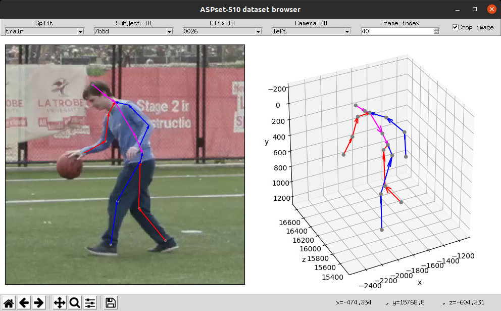

# ASPset-510


ASPset-510 (**A**ustralian **S**ports **P**ose Data**set**) is a large-scale video dataset for
the training and evaluation of 3D human pose estimation models. It contains 17 different amateur
subjects performing 30 sports-related actions each, for a total of 510 action clips.

This repository contains Python code for working with ASPset-510.


## Requirements

### Core

```bash
$ conda env create -f environment.yml
```

* python >= 3.7
* numpy
* [ezc3d](https://github.com/pyomeca/ezc3d)
* [posekit](https://github.com/anibali/posekit)

### GUI (Optional)

```bash
$ conda env update -f environment-gui.yml
```

* [PyOpenGL](http://pyopengl.sourceforge.net/)
* [glfw](https://github.com/FlorianRhiem/pyGLFW)
* matplotlib

### PyTorch (Optional)

```bash
$ conda env update -f environment-torch.yml
```


## Scripts

### Downloading the dataset

`download_data.py` downloads and extracts ASPset-510 data.

Example usage:

```bash
$ python src/aspset510/bin/download_data.py --data-dir=./data
```

Note that by default the original archive files will be downloaded and kept in the `archives`
subdirectory of whichever path you set using `--data-dir`. To set a different path for the
archives, use the `--archive-dir` option. To download the archives without extracting them,
use the `--skip-extraction` option.

### Browsing clips from the dataset

`browse_clips.py` provides a graphical user interface for browsing clips from ASPset-510.

Example usage:

```bash
$ python src/aspset510/bin/browse_clips.py --data-dir=./data
```




## Acknowledgments

ASPset-510 is brought to you by [La Trobe University](https://www.latrobe.edu.au/) and the
[Australian Institute of Sport](https://www.ais.gov.au/).
